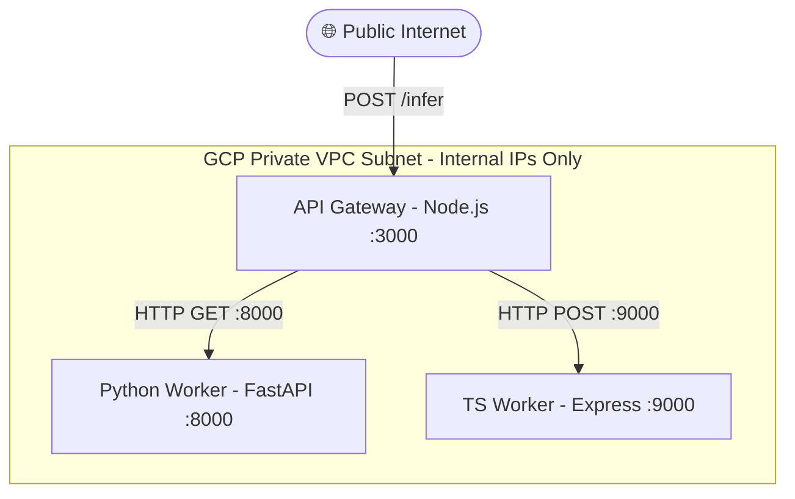

```markdown
# 🚀 GCP Distributed RPC Microservices Architecture

## 📌 Overview
This repository contains the infrastructure-as-code (Terraform) and application logic for a secure, multi-VM distributed RPC system deployed on Google Cloud Platform (GCP). 

The architecture demonstrates secure VPC design, private subnet isolation, and microservice orchestration using an API Gateway pattern.

## 🏗️ Architecture Design

The system is designed with a strict public/private separation. Only the API Gateway is exposed to the public internet, acting as the orchestrator. The worker nodes (Python and TypeScript) reside in a highly secure private subnet with no external IP addresses, ensuring they cannot be accessed directly from the outside world.



## 🛠️ Tech Stack

* **Infrastructure:** Terraform, Google Cloud Platform (GCP), Cloud NAT, VPC Networks
* **API Gateway:** Node.js, Express, Axios
* **Workers:** Python (FastAPI, Uvicorn), TypeScript/Node (Express)

## 🚀 How It Works

1. A client sends a `POST` request containing a text payload to the public API Gateway.
2. The Gateway securely orchestrates concurrent RPC (HTTP REST) calls to the internal IP addresses of the Python and TS Workers over the private VPC.
3. The isolated workers process the payload and return their respective JSON responses.
4. The Gateway aggregates the responses and returns a single, combined JSON payload back to the client.

### Example Request

```bash
curl -X POST http://<API_GATEWAY_EXTERNAL_IP>:3000/infer \
-H "Content-Type: application/json" \
-d '{"text":"hello alchemyst"}'

```

### Example Response

```json
{
  "gateway": "success",
  "python": {
    "python_worker": "Processed: hello alchemyst"
  },
  "typescript": {
    "ts_worker": "TS processed: hello alchemyst"
  }
}

```

## 🛡️ Security & Production Hardening

While this architecture demonstrates core networking principles, moving this to a production-grade environment would involve the following improvements:

* **Identity & Access Management (IAM):** Replace open internal firewall rules with strict Service Account-based access control. Workers should only accept traffic specifically originating from the Gateway's Service Account.
* **TLS Termination & Load Balancing:** Place a Global External Application Load Balancer in front of the API Gateway to handle HTTPS certificates, SSL termination, and DDoS protection via Google Cloud Armor.
* **Container Orchestration:** Transition the application deployments from raw VMs to Kubernetes (GKE) or Cloud Run for automated horizontal scaling, self-healing, and streamlined CI/CD deployments.
* **Asynchronous Queuing:** For computationally heavy inference tasks (e.g., LLMs), synchronous HTTP RPC calls can cause timeouts. Introduce Google Cloud Pub/Sub or a Redis Message Broker so the Gateway can enqueue jobs asynchronously and return a task ID.
* **Observability:** Integrate GCP Cloud Logging and Cloud Monitoring to track request latency between the Gateway and workers.

```

```
